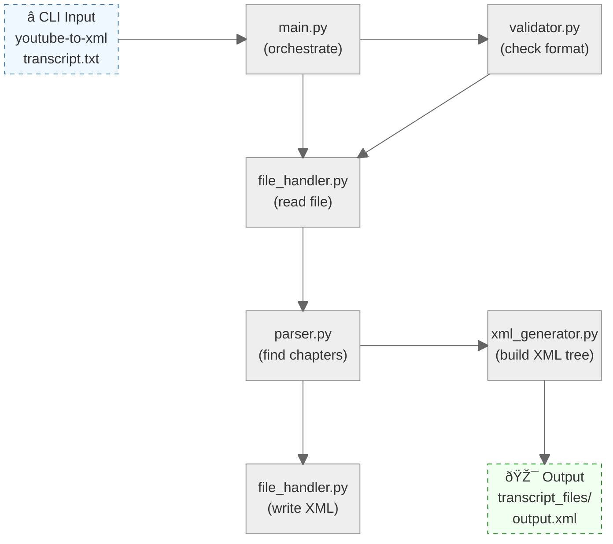

## Mermaid

```mermaid
---
config:
  theme: neutral
---
block-beta
    columns 5
    CLI["â­ CLI Input\nyoutube-to-xml\ntranscript.txt"] space MAIN["main.py\n(orchestrate)"] space VALIDATOR["validator.py\n(check format)"]
    space space space space space
    space space FILEREAD["file_handler.py\n(read file)"] space space
    space space space space space
    space space PARSER["parser.py\n(find chapters)"] space XMLGEN["xml_generator.py\n(build XML tree)"] space
    space space space space space
    space FILEWRITE["file_handler.py\n(write XML)"] space OUTPUT["🎯 Output\ntranscript_files/\noutput.xml"]
    CLI --> MAIN
    MAIN --> VALIDATOR
    MAIN --> FILEREAD
    VALIDATOR --> FILEREAD
    FILEREAD --> PARSER
    PARSER --> XMLGEN
    PARSER --> FILEWRITE
    XMLGEN --> OUTPUT
    style CLI fill:#f0f8ff,stroke:#4682b4,stroke-dasharray: 5 5
    style OUTPUT fill:#f0fff0,stroke:#228b22,stroke-dasharray: 5 5
```
