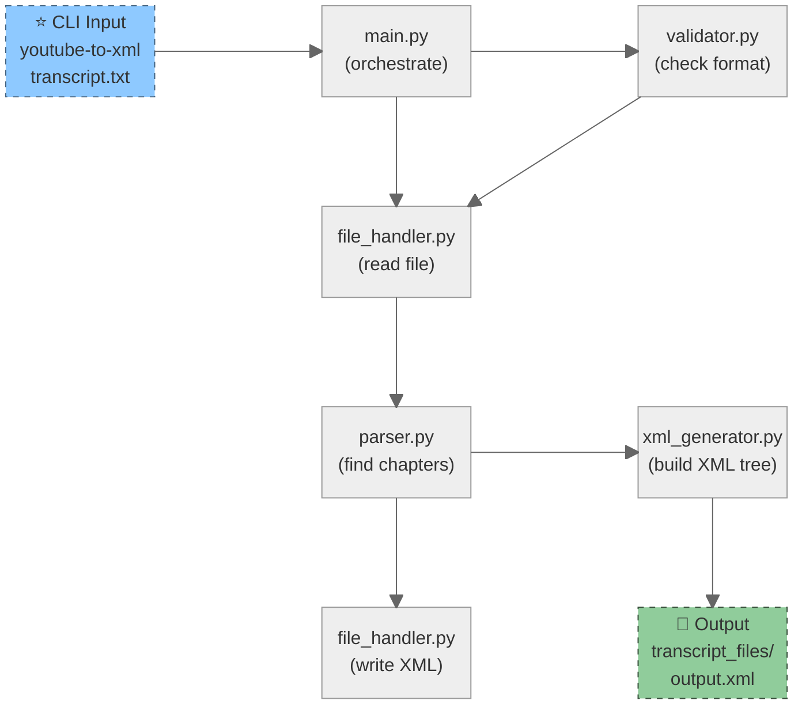
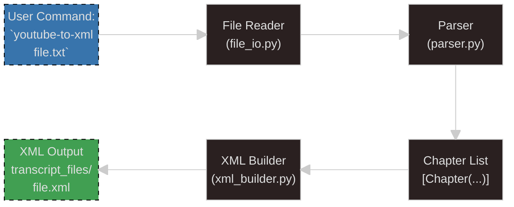
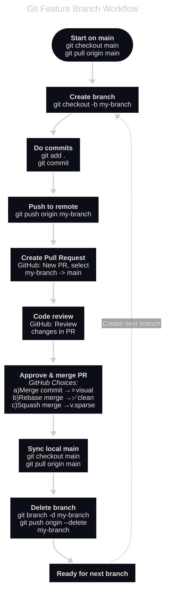

## Block-Beta 1 (neutral theme)

```mermaid
---
config:
  theme: neutral
---
block-beta
    columns 5
    CLI["⭐ CLI Input\nyoutube-to-xml\ntranscript.txt"] space MAIN["main.py\n(orchestrate)"] space VALIDATOR["validator.py\n(check format)"]
    space space space space space
    space space FILEREAD["file_handler.py\n(read file)"] space space
    space space space space space
    space space PARSER["parser.py\n(find chapters)"] space XMLGEN["xml_generator.py\n(build XML tree)"] space
    space space space space space
    space FILEWRITE["file_handler.py\n(write XML)"] space OUTPUT["🎯 Output\ntranscript_files/\noutput.xml"]
    CLI --> MAIN
    MAIN --> VALIDATOR
    MAIN --> FILEREAD
    VALIDATOR --> FILEREAD
    FILEREAD --> PARSER
    PARSER --> XMLGEN
    PARSER --> FILEWRITE
    XMLGEN --> OUTPUT
    style CLI fill:#8ec9ff,stroke:#46637e,stroke-dasharray: 5 5
    style OUTPUT fill:#90cc9b,stroke:#354c39,stroke-dasharray: 5 5
```

## Block-Beta 2 (neo-dark)

```mermaid
---
config:
  theme: neo-dark
---
block-beta
    columns 5
    CLI["User Command:\n`youtube-to-xml\nfile.txt`"] space FILEREADER["File Reader\n(file_io.py)"] space PARSER["Parser\n(parser.py)"]
    space space space space space
    XMLOUTPUT["XML Output\ntranscript_files/\nfile.xml"] space XMLBUILDER["XML Builder\n(xml_builder.py)"] space CHAPTERLIST["Chapter List\n[Chapter(...)]"]
    CLI --> FILEREADER
    FILEREADER --> PARSER
    PARSER --> CHAPTERLIST
    CHAPTERLIST --> XMLBUILDER
    XMLBUILDER --> XMLOUTPUT

    style CLI color:#fff,fill:#3874ac,stroke:#000,stroke-dasharray: 5 5
    style XMLOUTPUT color:#fff,fill:#419f52,stroke:#000,stroke-dasharray: 5 5
```

## Flow chart (redux-dark theme, dagre layout, markdown)

```mermaid
---
title: Git Feature Branch Workflow
config:
  look: neo
  layout: dagre
  theme: redux-dark
  htmlLabels: false
---
flowchart TD
    START(["`**Start on main**
    git checkout main
    git pull origin main`"]) --> CREATE["`**Create branch**
    git checkout -b my-branch`"]
    CREATE --> WORK["`**Do commits**
    git add .
     git commit`"]
    WORK --> PUSH["`**Push to remote**
    git push origin my-branch`"]
    PUSH --> PR["`**Create Pull Request**
    GitHub: New PR, select
    my-branch -> main`"]
    PR --> REVIEW["`**Code review**
    GitHub: Review
    changes in PR`"]
    REVIEW --> APPROVE["`**Approve & merge PR**
    *GitHub Choices:*
    a)Merge commit →⭐visual
    b)Rebase merge →✅clean
    c)Squash merge →v.sparse`"]
    APPROVE --> SYNC["`**Sync local main**
    git checkout main
    git pull origin main`"]
    SYNC --> CLEANUP["`**Delete branch**
    git branch -d my-branch
    git push origin --delete my-branch`"]
    CLEANUP --> NEXT["`**Ready for next branch**`"]
    NEXT -.-> |Create next branch| CREATE
```
